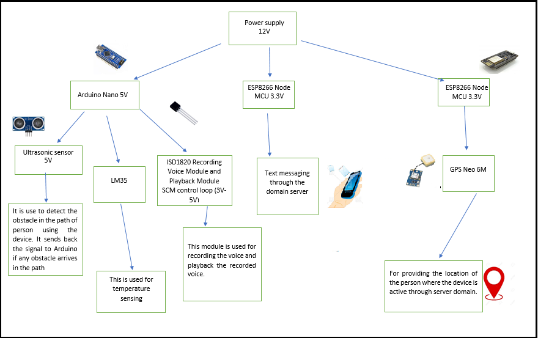
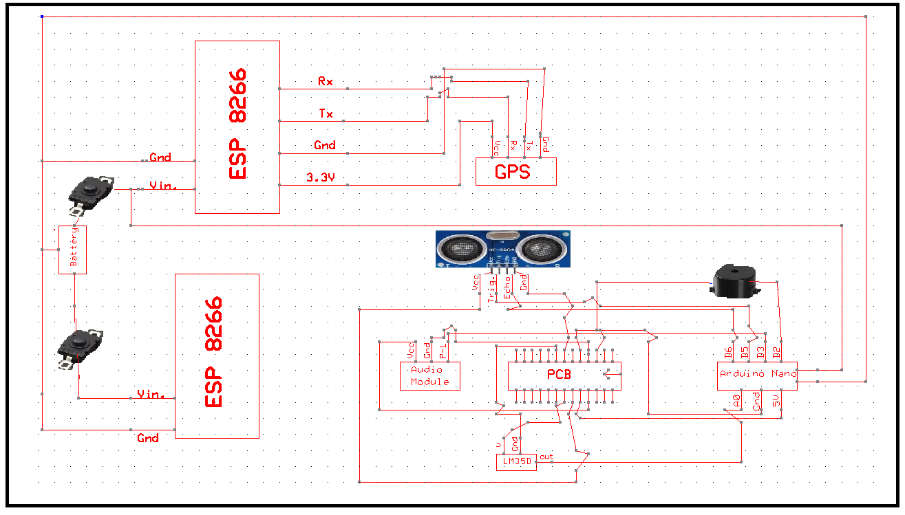

# Smart Stick With Audio Feedback And SOS Button For Visually Impaired Person 

## Brief Summary of the project :
Developed Smart Stick detects obstacle using Ultrasonic sensor and provide feedback to visually impaired person in the form of Audio Using Text to Speech Conversion provides location of the one of its caretaker on pressing Save of Soul (SOS) Button . Available sticks for visually impaired person provides response either by vibration or using buzzer but in our project we are using text to speech technology (android) which converts ultra-sonic sensors data (distance from an obstacle) into an audio file and play sit. We are using an additional SOS feature which is enhancement of already present technologies. SOS (Save our soul) button provides emergency help and sends user location to relatives using GPS. India Is Home to the world’s largest number of visually impaired people. Of the 37 Million people across the globe who are blind, over 15 Million are from India. Our customers will be visually impaired people. We are providing an advancement of audio feedback; therefore our innovation will indeed neutralize their disability at low cost. Our approximated estimated cost of the stick will be around 3000 on mass production.

With the help of this smart stick person will able to detect any stationary or slowly moving object or obstacle via ultrasonic sensor at a distance of 45 cm from stick and provides beeps and audio messages as output. It also increases a frequency of beep with the decrease in distance of obstacle and sticks. It also has an SOS button. On clicking those buttons a message will send to the guardian of the person his/her live location with the help of a Wi-Fi and GPS modules and servers.

## BLOCK DIAGRAM :

## Circuit Diagram :

## Product/technology details developed through the project :

With the help of this smart stick person will able to detect any stationary or slowly moving object or obstacle via ultrasonic sensor at a distance of 45 cm from stick and also increase a frequency of buzzer when distance of obstacle and stick decreases. When ultrasonic sensor measures the distance less than45 cm sensor transmit signal to the audio module which starts buzzing sound with increasing frequency of buzzing when distance transmitted by ultrasonic sensor decreases.
It also has an SOS button. On clicking that button a message will send to the guardian of the person using the stick with his/her live location with the help of a Wi-Fi and GPS modules and servers. GPS module gives live location to the Wi-Fi module which sends the position and to the servers which in turn sends the location in the form link in the message. 

